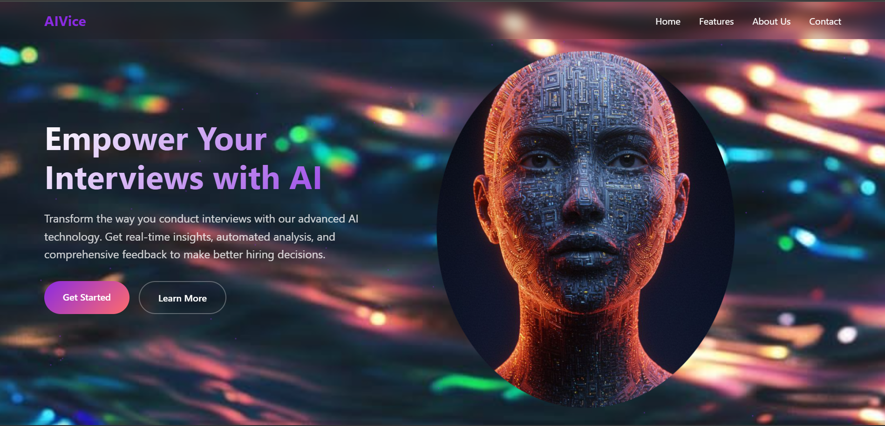
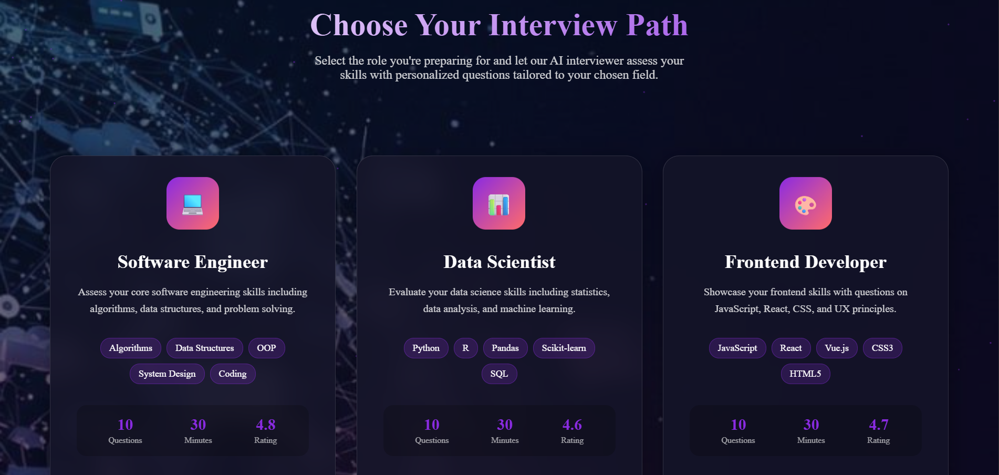
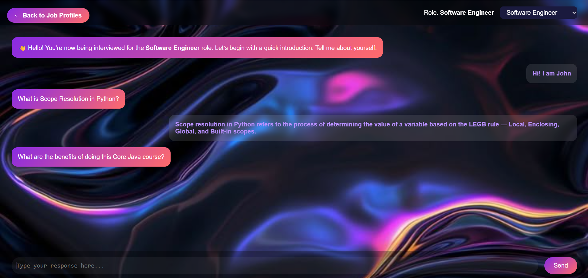

# 🚀 AIVice - AI-Powered Interview Assistant 🤖

💡 An AI-powered tool designed to simulate job interviews, providing users with realistic practice and feedback to improve their interviewing skills.

## 📖 Introduction

🤖 The AIVice is a Flask-based application that helps job seekers prepare for technical interviews.  
🔍 It leverages custom-made datasets of interview questions and:  
🧠 A pre-trained DistilBERT model to evaluate user responses  
💬 Provides constructive feedback  
🎯 Simulates real interview experience  
⚡ Makes interview preparation efficient and effective

## ✨ Features

* 🎯 **Job-Specific Interviews**: Chooses questions based on selected job role  
* 💬 **Realistic Simulation**: Conversational interface mimicking real interviews  
* 🧠 **AI-Powered Evaluation**: Uses DistilBERT model to evaluate responses  
* 📊 **Scoring and Feedback**: Provides score (0-100) with feedback  
* 🔄 **Session Management**: Tracks progress throughout interview  
* 🖥️ **Frontend Interface**: User-friendly interface for mock interviews  
* 📚 **Database**: 5000+ questions and answers for model training

## 🛠️ Technologies Used

### 🔧 Backend:
* 🐍 Python  
* 🌐 Flask: Web framework for API  
* 🤖 Transformers: For pre-trained models  
* 🔥 PyTorch: Deep learning framework  
* 🐼 Pandas: Data analysis  
* 🔄 Flask-CORS: Handles CORS

### 🎨 Frontend:
* 🖊️ HTML  
* 🎨 CSS  
* 🖱️ JavaScript

### 🧠 Model Training:
* ⚙️ Transformers  
* 📦 Datasets  
* 📏 Evaluate  
* 🔬 Scikit-learn  
* 📊 Weights & Biases (W&B)

### 🔍 Other:
* � Beautiful Soup  
* 📡 Requests

## 🚀 Installation

## 🚀 Installation

1. 🖥️ **Clone the repository:**
   ```bash
   git clone https://github.com/Bedagya-Bordoloi/AI-interview-bot.git
   cd AI-interview-bot

2.  **INSTALL DEPENDENCIES:**
    ```bash
    pip install -r requirements.txt
    ```

3.  **RUN THE APPLICATION:**
    ```bash
    python app.py
    ```

4.  **ACCESS THE APPLICATION:**
    Open your web browser and go to `http://127.0.0.1:5000/`

## 📂 Code Structure

* 📄 `app.py`: Main Flask application  
* 📁 `Score_Evaluation_Model/`: DistilBERT model files  
* 📂 `frontend/`: All frontend files  
  * 📄 `index.html`: Landing page  
  * 📄 `job_profile.html`: Profile selection  
  * 📄 `interviewbot.html`: Interview interface  
* 📓 `AI Interview Question Answer Dataset Creation.ipynb`: Dataset creation  
* 📔 `AI Interview Dataset Generator.ipynb`: Conversation generator  
* 📒 `Score Evaluation Model WandB.ipynb`: Model training notebook

## 🤖 Training the Model

🧠 The score evaluation model uses fine-tuned DistilBERT:

1. 📝 Prepare training data with Q/A pairs and scores  
2. 🏋️ Run the training notebook  
3. 💾 Save model in `Score_Evaluation_Model/scoring_distilbert_model/`

## 👥 Contributors

* 👤 [Krishanu](https://github.com/Krishanu)  
* 👤 [Bedagya-Bordoloi](https://github.com/Bedagya-Bordoloi)

## 🔮 Future Enhancements

* ⚡ More sophisticated AI models  
* ➕ More job roles and datasets  
* ✨ Improved UI with real-time feedback  
* 🎯 Personalized question generation

## 📸 Snaps for the Website

### 🏠 Homepage





---


### 💼 Choose Your Job Role





---


### 🧑‍💻 Start Your Interview



